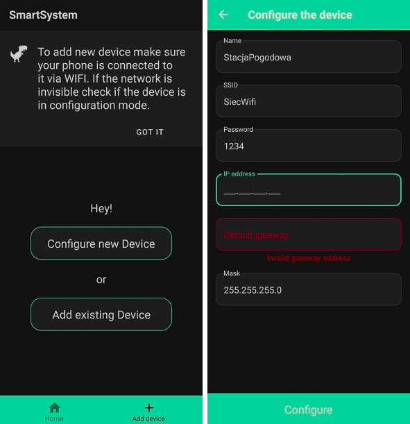

# SmartHome

### A mobile app used as user interface to various IoT devices.

The aplication allows to configure, control and check the status of devices such as weather station, RGB lamp or relay based on ESP8266 microcontroller.

